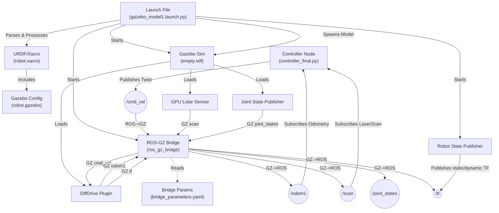

# potential field method Obstacle avoidance and navigation Simulation Pipeline Knowledge Graph

> 📖 **Curious about the physics and algorithms behind this project?**
> Read the [Project Philosophy & Theory](ABOUT.md) to understand why the Potential Field Method shines in dynamic environments!

## 🎥 Demonstrations

### Potential Field Navigation


https://github.com/user-attachments/assets/5145754d-304b-4c74-9f32-dd2a53f5f20a


### RViz2 Goal Setting

https://github.com/user-attachments/assets/9c153af1-bfb4-4f40-b7b5-6fc32a9876ef


This repository contains a ROS 2 and Gazebo Harmonic simulation pipeline for a differential drive mobile robot. Below is a comprehensive breakdown of the pipeline, how the components interact, and a knowledge graph depicting the system's architecture.

## 📦 Dependencies

To successfully run this pipeline, you will need the following installed on your system:
- **ROS 2** (Humble or Jazzy recommended)
- **Gazebo Harmonic**
- **ROS-Gazebo Integration:** `ros_gz_bridge`, `ros_gz_sim`, and `ros_gz_interfaces`
- **Python Packages:** `matplotlib`, `numpy`, `tf_transformations`

## 🧠 System Knowledge Graph



## 🏗️ Pipeline Components

### 1. Launch System (`launch/gazebo_model1.launch.py`)
This is the entry point of the simulation pipeline. It orchestrates the entire setup by:
*   **Processing the URDF/Xacro:** Reads the `model/robot.xacro` file and processes it into an XML string (URDF) for the robot's description.
*   **Starting Gazebo:** Includes the `ros_gz_sim` launch file to start the Gazebo simulator with an empty world.
*   **Spawning the Model:** Uses `ros_gz_sim create` to inject the processed robot description into the Gazebo world.
*   **Starting Robot State Publisher:** Runs the `robot_state_publisher` node, passing the robot description to publish transforms (TF).
*   **Starting the Parameter Bridge:** Launches `ros_gz_bridge` using the configuration defined in `parameters/bridge_parameters.yaml`.

### 2. Robot Description Model
*   **`model/robot.xacro`:** Defines the physical and visual properties of the differential drive robot (links, joints, inertia, dimensions). It defines the `base_footprint`, `body_link`, wheels, caster wheel, and the LiDAR sensor.
*   **`model/robot.gazebo`:** Extends the URDF with Gazebo-specific configurations, materials, and plugins. It includes:
    *   `gz::sim::systems::DiffDrive`: The differential drive controller. It subscribes to `cmd_vel` and publishes odometry to `odom1` and transforms to `/tf`.
    *   `gz::sim::systems::JointStatePublisher`: Publishes the joint states of the wheels.
    *   `gz::sim::systems::Sensors`: Enables the GPU LiDAR sensor, which publishes to `scan` at 20 Hz.

### 3. ROS-Gazebo Bridge (`parameters/bridge_parameters.yaml`)
Acts as the communication middleware between ROS 2 topics and Gazebo Harmonic topics. It translates:
*   **ROS -> GZ:** `cmd_vel` (commands to drive the robot).
*   **GZ -> ROS:** `odom1` (odometry), `scan` (lidar data), `tf` (transforms), `joint_states` (joint positions), and `clock` (simulation time).

### 4. Controller Nodes (`controller_final.py` & `controller2.py`)
This package contains two custom ROS 2 controller nodes that implement an Artificial Potential Field (APF) algorithm for autonomous navigation.
*   **Inputs:** Subscribes to `/odom1` for the robot's current pose and `/scan` for obstacle detection.
*   **Outputs:** Computes the attractive forces (towards the goal) and repulsive forces (away from obstacles) to generate velocity commands published to `/cmd_vel`.
*   **`controller_final`**: Includes real-time plotting of distance to obstacles and the goal.
*   **`controller2`**: Includes more detailed real-time plotting, adding graphs for attractive, repulsive, and net forces.

## 🚀 How to Run

To run the pipeline, you will need to open two separate terminals: one for the simulation environment (Launch) and one for the navigation logic (Controller).

### Step 1: Launch the Simulation Environment

There are two simulation scenarios available. Open a terminal, source your workspace, and run **one** of the following commands:

**Scenario A (Empty World):**
```bash
ros2 launch mobile_robot gazebo_model1.launch.py
```

**Scenario B (Custom World with Obstacles):**
```bash
ros2 launch mobile_robot gazebo_model.launch.py
```

### Step 2: Run the Navigation Controller

Open a second terminal, source your workspace, and run **one** of the following controller nodes (both work with either simulation scenario):

**Option 1 (Standard Controller - 2 Graphs):**
```bash
ros2 run mobile_robot controller_final
```

⭐ **Option 2 (Detailed Controller - 4 Graphs) [RECOMMENDED]:**
```bash
ros2 run mobile_robot controller2
```

*(Note: The controller will hold the robot in place until a goal is set.)*

### Step 3: Launch RViz2 & Set a Goal

Open a third terminal, source your workspace, and run the dedicated RViz2 launch file:
```bash
ros2 launch mobile_robot rviz.launch.py
```
This will open RViz2 with the **RobotModel** and **LaserScan** (LiDAR) already configured and visible. To command the robot:
1. Click the **2D Goal Pose** button in the top toolbar.
2. Click anywhere in the visible free space (within LiDAR bounds) to set a goal. The robot will start moving immediately!
